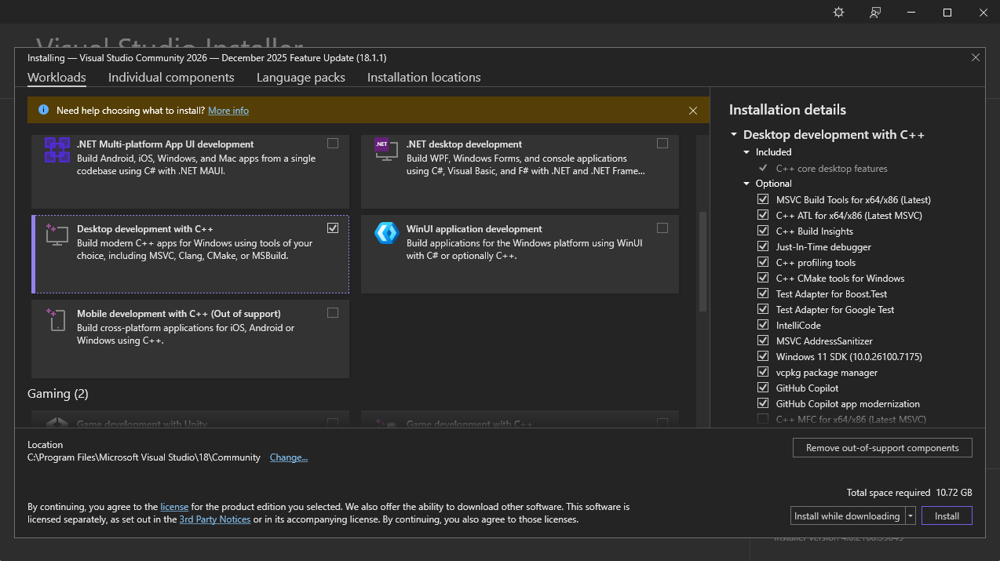
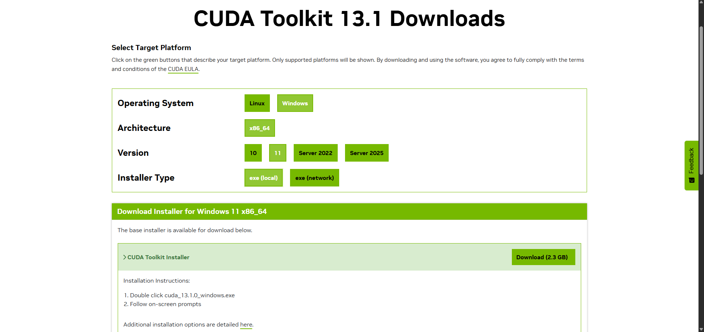
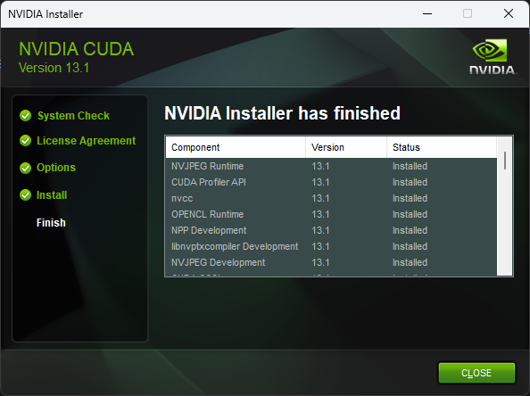
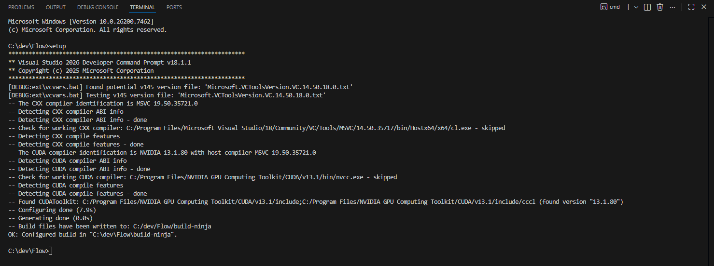
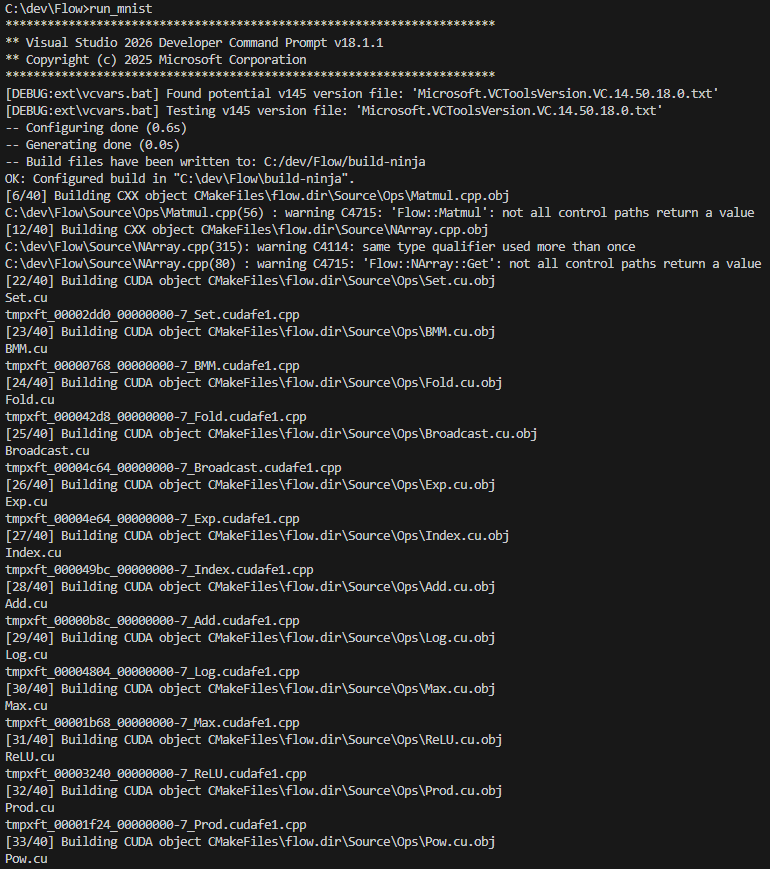
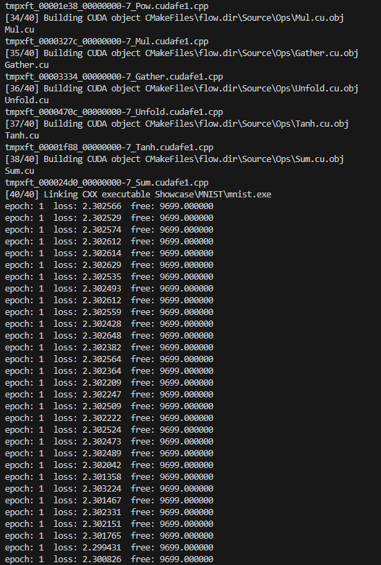

1. Install Visual Studio 2026: https://visualstudio.microsoft.com




2. Install NVIDIA CUDA Toolkit 13.1: https://developer.nvidia.com/cuda/toolkit





3. Run ```setup.bat```



That's it!

You can now run ```run_mnist.bat``` to run the MNIST demo:



