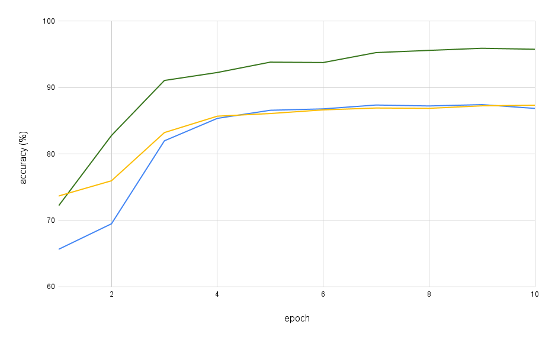
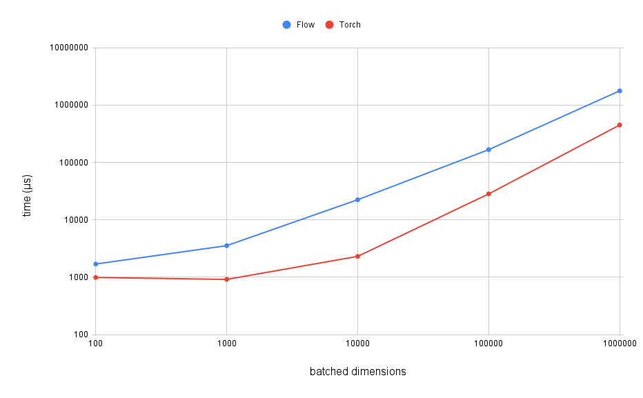

# Flow 🌊
Machine Learning Library in C++
## Features ✨
- N dimensional array operations
  - Addition, multiplication, ReLU, matrix multiplication, ...
- Autograd system
- GPU acceleration with CUDA
- Deep neural networks
## Example: MNIST classifier 🔢
See ```"Showcase/MNIST/"```<br>
```cpp
// Create the Convolutional Neural Network module.
class CNN : public Flow::Module
{

public:

    // This network has two convolutional layers and two linear layers.
    // These layers store weights and biases which are used for learning after backpropagation.
    shared_ptr<Flow::Convolution> Conv1, Conv2;
    shared_ptr<Flow::Linear> Linear1, Linear2;

    // Define the network structure and create the submodules on construct.
    CNN()
    {
        Conv1 = Flow::Convolution::Create( 1, 10, { 5, 5 } );
        Conv2 = Flow::Convolution::Create( 10, 20, { 5, 5 } );
        Linear1 = Flow::Linear::Create( { 320, 50 }, { 50 } );
        Linear2 = Flow::Linear::Create( { 50, 10 }, { 10 } );
        Modules = { Conv1, Conv2, Linear1, Linear2 };
    }

    // Forward pass for the network.
    // Calls submodules previously defined and uses other operations that don't store parameters.
    NARRAY Forward( NARRAY arr ) override
    {
        NARRAY a1 = Flow::Unsqueeze( arr, 1 );
        NARRAY a2 = Flow::ReLU( MaxPool2d( Conv1->Forward(a1), { 2, 2 } ) );
        NARRAY a3 = Flow::ReLU( MaxPool2d( Conv2->Forward(a2), { 2, 2 } ) );
        NARRAY a4 = Flow::Reshape( a3, { a3->GetShape()[0], 320 } );
        NARRAY a5 = Flow::ReLU( Linear1->Forward(a4) );
        NARRAY a6 = Linear2->Forward(a5);
        return Flow::Softmax( a6, 1 );
    }

};

int main()
{
    // ...

    // Define the network object.
    CNN network;

    // Create an optimizer for the network.
    // It is responsable for updating the parameters based on the new gradients.
    Flow::Optimizer optimizer( network.GetParameters(), 0.001f, 1e-8f, 0.0f );

    // Training loop.
    for ( int epoch = 0; epoch < 10; epoch++ )
    {
        auto batches = Flow::CreateBatches( xTrain, yTrain, 100 );
        for ( auto batch : batches )
        {
            NARRAY yPredicted = network.Forward(batch.first);
            NARRAY loss = Flow::CrossEntropy( yPredicted, batch.second );
            optimizer.ZeroGrad();
            loss->Backpropagate();
            optimizer.Step();
        }
    }
}
```
<br>
After running three trials of this code on a machine with a NVIDIA QUADRO P5000, the best accuracy for classifying digits was 96%. This is a very simplistic convolutional network and it can be improved to achieved better accuracy. For example, introducing dropout.<br><br>

The total time for training was 21 minutes for the best trial. Other ML libraries such as Torch would train this network in less time (<10 mins). Nonetheless, <em>Flow</em> is at an early stage of development and it is reassuring to see how it can successfully train a convolutional neural network in reasonable time.

## Performance 📈
Running batched matrix multiplications with varying batch sizes (from 100 to 1000000) and comparing the performance to the same operations using Torch.
```cpp
int batchSize = 100;
NARRAY arr1 = Flow::RandomUniform( { batchSize, 3, 4 }, -0.9999f, 0.9999f );
NARRAY arr2 = Flow::RandomUniform( { batchSize, 4, 5 }, -0.9999f, 0.9999f );
NARRAY result = Flow::Matmul( arr1, arr2 );
```

